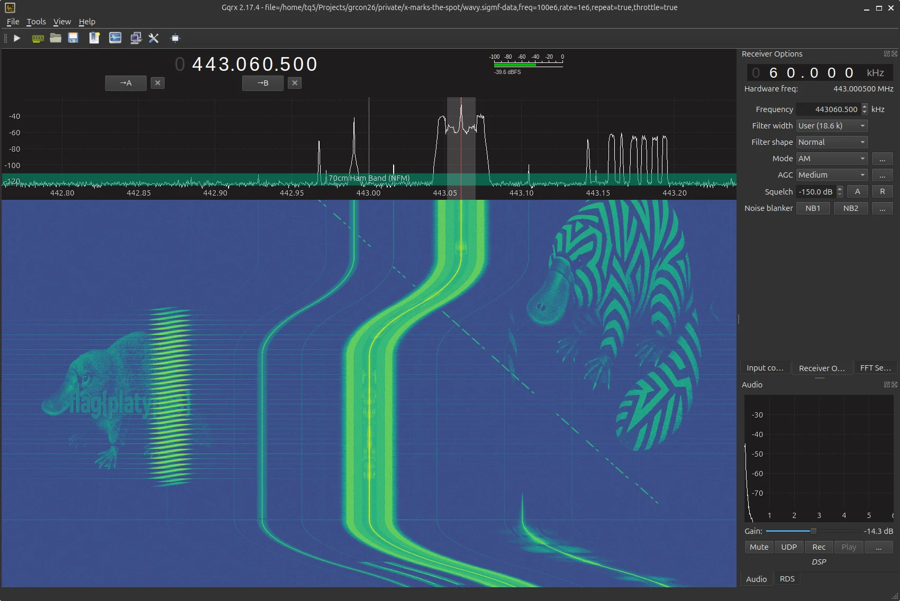

# CTF Challenges for GRCon26

GNU Radio Conference 2026 at North Carolina State University in September 2026.

## Overview

We assign our puzzles points in the range of (23, 199) based on difficulty.

## Layout

Each challenge has a `public/` folder that holds files facing the challenger, and a `private/` folder with solutions and creation files for the challenge.

## Order of Challenges

All challenges should be released sequentially over the _first_ day at GRCon.

## Prior Work

* Our [2022 challenge repository](https://github.com/bebau/grcon22).
* Our [2023 challenge repository](https://github.com/Teque5/grcon23).
* Our [2024 challenge repository](https://github.com/Teque5/grcon24).
